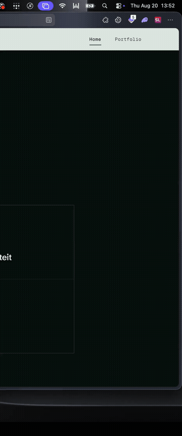

# Edge Todo

A minimal macOS edge drawer for quick todos.



Hover the **right edge** of your screen — a dark glass panel slides in. Add tasks, check them off, move on. No Dock icon, no menu bar icon — just the edge panel. Saves to disk automatically.

## Requirements

- macOS 14+
- Xcode Command Line Tools (`xcode-select --install`)

## Run

```bash
./Scripts/run.sh
```

Build only:

```bash
./Scripts/build.sh
open .build/EdgeTodo.app
```

For a stable login item, install somewhere lasting (recommended — `./Scripts/run.sh` does this):

```bash
./Scripts/build.sh
cp -R .build/EdgeTodo.app /Applications/
open /Applications/EdgeTodo.app
```

## Use

1. Move your cursor to the right edge of the screen
2. Type a task and press Enter
3. Click the circle to complete, × to delete

### Open at Login

On first launch, Edge Todo registers itself to start when you log in.

Manage it under **System Settings → General → Login Items** (EdgeTodo).

## Data

Todos are stored at `~/Library/Application Support/EdgeTodo/todos.json`.

## Stack

Native Swift + SwiftUI + AppKit (`NSPanel`). No Electron, no dependencies.

## License

MIT
